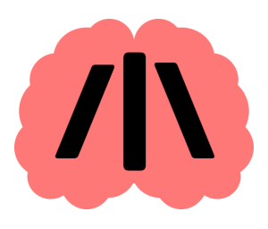

# Stroke {/|\\}



**Stroke** is an esoteric structured programming language.

With its only three commands, it aims to be the simplest structured programming language ever.

It uses conditional loops and an unbounded number of binary variables, along with a command to flip their values.

## Language

Stroke code consists only of stroke symbols `/`, `|`, `\`, and white spaces to separate them. All other symbols are ignored.

### Commands

| Command | Name | Meaning |
| ------- | ---- | ------- |
| `/ var` | Loop start | Enters a new loop if *var* is non-zero |
| `\` | Loop end | Jumps back to the corresponding loop start |
| `\|` × *n* | Flip value | Flips the value of the variable *n*-1 |

All commands and attributes are separated by one or more white spaces.

The example code in stroke:

```stroke
| 
/ | 
  | 
  || 
\ 
|||
```

can be translated into the following pseudocode:

```
flip v0
while v0
  flip v0
  flip v1
flip v2
```

Optionally, a command for output `!` may be implemented.

### Variables

A stroke program runs on a theoretically infinite tape of binary cells that are randomly accessible via variables denoted by consecutive vertical stroke symbols (`|`) in unary form starting from zero. For instance, `|` flips the variable indexed by 0, `||` flips the variable indexed by 1, `|||` flips the variable indexed by 2, and so on.

A variable occurring in code directly after a loop start will be just read (and checked to be non-zero), while a variable anywhere else in the code will flip its binary value.

The binary tape can simulate integers of arbitrary size, e.g. 4-bit unsigned:

```
  variable index   0  1  2  3  4  5  6  7  8  9  10 11 ...
       bit index   3  2  1  0  3  2  1  0  3  2  1  0  ...
virtual variable   \   A    /  \   B    /  \   C    /  ...
```

## Examples

The following examples operate on virtual 4-bit variables *A*, *B*, and *C*.

### Empty program

The simplest program is the empty program:

```stroke
```

### Infinite loop

As variable *0* is never reset, the program loops forever:

```stroke
| / | \
```

### Conditional branching

Conditional branching (IF) can be simulated via loops:

```stroke
IF A:
|||||||       running
/ | |         first bit not zero
    |||||     result
    ||||||    shall reset bit
    |||||||   stop
\
/ |||||| |||||| | \  reset bit
/ |||||||            still running
    / || ||          second bit not zero
    |||||            result
    ||||||           shall reset bit
    |||||||          stop
    \
    / |||||| |||||| || \  reset bit
    / |||||||             still running
    / ||| |||             third bit not zero
        |||||             result
        ||||||            shall reset bit
        |||||||           stop
    \
    / |||||| |||||| ||| \  reset bit
    / |||||||              still running
        / |||| ||||        fourth bit not zero
        |||||              result
        ||||||             shall reset bit
        \
        / |||||| |||||| |||| \  reset bit
        |||||||                 stop (all bits checked)
    \
    \
\
/ ||||| |||||  
  
  do something conditionally...

\
```

### Equality check

Compares *A* and *B* bit by bit:

```stroke
EQ A B => v8:
||||||||| ||||||||||||| |||||||||||
/ | | ||||||||||||
    / ||||| ||||| |||||||||| |||||||||||| \
    / |||||||||| |||||||||| ||||| \
    / |||||||||||| |||||||||||| ||||||||| ||||||||||||| \
    |||||||||| |||||||||||
\
/ |||||||||| |||||||||| | \
/ ||||||||||| ||||||||||| 
    / ||||| ||||| |||||||||| ||||||||| |||||||||||||
    / |||||||||| |||||||||| ||||| \
\
/ ||||||||||||| |||||||||||
    / || || ||||||||||||
    / |||||| |||||| |||||||||| |||||||||||| \
    / |||||||||| |||||||||| |||||| \
    / |||||||||||| |||||||||||| ||||||||| ||||||||||||| \
    |||||||||| |||||||||||
    \
    / |||||||||| |||||||||| || \
    / ||||||||||| |||||||||||
    / |||||| |||||| |||||||||| ||||||||| ||||||||||||| \
    / |||||||||| |||||||||| |||||| \
    \
    / ||||||||||||| |||||||||||
    / ||| ||| ||||||||||||
        / ||||||| ||||||| |||||||||| |||||||||||| \
        / |||||||||| |||||||||| ||||||| \
        / |||||||||||| |||||||||||| ||||||||| ||||||||||||| \
        |||||||||| |||||||||||
    \
    / |||||||||| |||||||||| ||| \
    / ||||||||||| |||||||||||
        / ||||||| ||||||| |||||||||| ||||||||| ||||||||||||| \
        / |||||||||| |||||||||| ||||||| \
    \
    / ||||||||||||| |||||||||||
        / |||| |||| ||||||||||||
        / |||||||| |||||||| |||||||||| |||||||||||| \
        / |||||||||| |||||||||| |||||||| \ 
        / |||||||||||| |||||||||||| ||||||||| \
        |||||||||| |||||||||||
        |||||||||||||
        \
        / |||||||||| |||||||||| |||| \
        / ||||||||||| |||||||||||
        / |||||||| |||||||| |||||||||| ||||||||| \
        / |||||||||| |||||||||| |||||||| \
        |||||||||||||
        \
    \
    \
\
\ ||||||||| |||||||||

  do something if equal...

/
```

### Increment and decrement

The following program increments *A* and decrements *B*:

```stroke
INC A:    
||||||       carry
/ |||| |||| ||||| |||||| \
/ ||||| ||||| |||||| 
    / ||| ||| ||||| |||||| \
    / ||||| ||||| ||||||
    / || || ||||| |||||| \
    / ||||| ||||| ||||||
        / | | |||||| \
        / |||||| |||||| | \
    \
    / |||||| |||||| || \
    \
    / |||||| |||||| ||| \
\
/ |||||| |||||| |||| \

DEC B:
|||||||||
/ |||||||| |||||||| ||||||||| \
/ ||||||||| ||||||||
/ ||||||| ||||||| ||||||||| \
/ ||||||||| ||||||| 
    / |||||| |||||| ||||||||| \
    / ||||||||| |||||| 
    / ||||| ||||| ||||||||| \
    / ||||||||| |||||
        |||||||||
    \
    \
\
\
```

### Addition

Having conditional branching, increment, and decrement intact, 
  a program to add *A* and *B* is just a simple composition:

```stroke
ADD A B => A:
IF B
   INC A
   DEC B
```

### Fibonacci sequence

```stroke
FIB:
x 
/ x   forever
  IF B
     DEC B
     INC C
  IF A
     DEC A
     INC B
  IF C
     DEC C
     INC A
     INC B  
\
```

### Hello World

For computing "Hello World" the tape must interpreted as a string. 
  It can achieved by defining a binary alphabet:

| Symbol | Binary |
| ------ | ------ |
| ` `    | 000    |
| `d`    | 001    |
| `e`    | 010    |
| `H`    | 011    |
| `l`    | 100    |
| `o`    | 101    |
| `r`    | 110    |
| `W`    | 111    |

The following program set the tape to `011010100100101000111101110100001`
  which corresponds to "Hello World":

```stroke
|| ||| ||||| ||||||| |||||||||| 
||||||||||||| ||||||||||||||| 
||||||||||||||||||| 
|||||||||||||||||||| 
||||||||||||||||||||| 
|||||||||||||||||||||| 
|||||||||||||||||||||||| 
||||||||||||||||||||||||| 
|||||||||||||||||||||||||| 
|||||||||||||||||||||||||||| 
|||||||||||||||||||||||||||||||||
```

## Computational class

As every variable (bit) must be represented in code as a sequence of `|` the program cannot access an infinite number of bits as required for Turing completeness.

Practically, variables of arbitrary size can be used which brings the language very close to being Turing complete according to [the structured program theorem](https://en.wikipedia.org/wiki/Structured_program_theorem), as conditional branching (selection) can easily be simulated via loops.

## JavaScript interpreter

```sh
npm i stroke-lang
```

```js
const stroke = require('stroke-lang')

stroke('| / | | || \\ |||')  // "011"
```

## License

[MIT](LICENSE)
